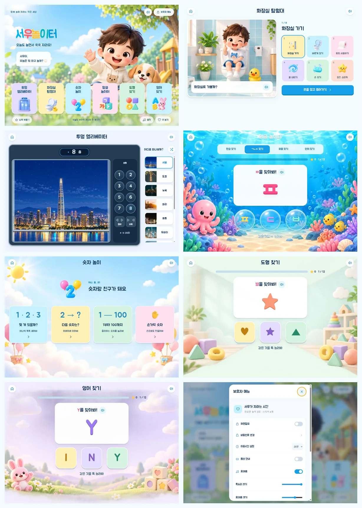
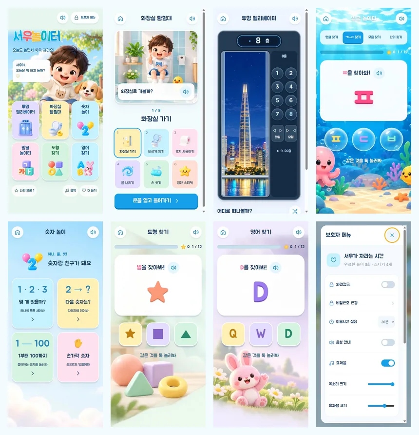

# 구현 및 QA 기록

검증일: 2026-09-17. 기준 소스: pswgames/pswgames.github.io `873fa30590a5e660d75da6f9771d496085302bd2`.

## 실제 실행

Windows의 로컬 서버에서 앱을 실행했습니다. 실제 Chromium 브라우저로 홈, 화장실, 엘리베이터, 말글, 숫자, 도형, 영어, 보호자 진입을 열고 스크린샷을 확인했습니다. 기본 태블릿 가로 1180×820, 세로 768×1024, 휴대폰 390×844와 작은 화면 360×780을 확인했습니다.

주요 화면을 각각 캡처하고 사용자 레퍼런스와 비교했습니다. 태블릿 홈의 캐릭터·강아지, 파스텔 6개 카드, 화장실 장면과 6개 안내 카드, 투명 엘리베이터, 해저 버블, 차분한 보호자 설정이 공통 디자인으로 보이는지 검토했습니다. 홈 카드는 가로 6열/세로 3×2로 바뀌고, 태블릿 세로 768×1024에서 마지막 카드 하단은 934px, 하단 메뉴는 1000px 안에 들어옵니다.

## 기능 검사

`pnpm test` 통과.

- 모든 앱 스크립트 구문, HTML/CSS 에셋 참조, 오프라인 캐시 목록, 이미지 Base64 미삽입, 설치 유도 버튼 없음.
- 음성 선로딩 재사용, 취소 시 Promise 종료, 오류 대체 재생 1회, 전체 정지, 음소거, 볼륨 범위.
- 홈의 여섯 활동, 말글 네 모드, 정답/오답, 중복 탭 방지, 다음 문제, 12문제 완료/기록/재시작.
- 화면을 떠난 후 오래된 문제 타이머가 화면을 바꾸지 않음. 물 내림 도중 홈으로 나갔다 돌아와도 진행 가능.
- 숫자, 순서, 손가락, 1–100, 영어, 도형, 색, ABC/그림 단어, 리듬, 기억, 음악, 보물, 함께하기 등 17개 경로 렌더링.
- 화장실 8단계, 선택, 물 내림, 손 씻기 세 번, 완료 기록 및 중복 완료 방지.
- 테스트 전용 메모리 환경에서 PIN 1회 입력·변경·해시 저장·오입력 차단·음성/이용시간 설정.
- 기존 `seowoo-play-v3` 저장 키, 무작위 선택의 항목 보존.
- 엘리베이터의 예약 층, 부드러운 중간 위치 전달, 이동 중 문 열기 차단, 수동 문 조작, 비활성/복귀, 1–20층, 화면 종료 시 프레임 정리.

실제 브라우저에서 숫자 정답 피드백, 자음 찾기 탭 전환, 화장실 단계, 엘리베이터 4→8층 이동과 랜덤 도시 선택, 추가 층 펼치기, 보호자 진입 화면과 스크롤도 확인했습니다. 온라인 최종 브라우저 검사에 기록된 console warning/error는 없습니다.

로컬 서버를 실제로 종료한 뒤 앱을 새로고침했습니다. 오프라인 캐시에서 홈이 다시 실행되고 엘리베이터 진입·도쿄 전환이 동작했습니다. 도시 이미지 10개와 선택된 파노라마가 모두 로드된 상태임을 확인한 후 서버를 다시 시작했습니다. 외부 서버나 외부 이미지 요청 없이 실행되는 경로를 검증했습니다.

## Visual QA로 수정한 항목

- 장난감 스타일이 달랐던 화장실 카드 → 동일한 3D 스프라이트.
- 서울 배경의 전경 구조물이 창을 가리던 문제 → 별도 서울 야경 일러스트와 이동에 맞춘 구도.
- 도시 카드가 늘면서 휴대폰 화면이 옆으로 밀리던 문제 → 그리드 자식의 최소 폭 해제.
- 엘리베이터 버튼 패널의 내부 가로 스크롤 → 48px 버튼 두 개와 간격이 정확히 들어가도록 정리.
- 휴대폰 배경의 부자연스러운 경계 → 장면 가장자리 마스크.
- 일부 한국어 조사 → 자음·받침·영어 글자 이름에 맞게 수정.
- 페이지별 반경/간격 선언 → 중앙 토큰 참조로 정리.
- 기존 픽셀형 앱 아이콘 → 서우와 강아지의 불투명 3D 아이콘.

검사한 화면의 버튼은 48px 이상이며 최종 모바일 페이지 폭은 뷰포트를 넘지 않습니다. 긴 화장실/엘리베이터/보호자 화면은 세로 스크롤을 허용합니다. 도시 선택만 가로 스크롤합니다.

## 증거와 범위 구분

제공한 QA 폴더에는 화면별 PNG, tablet-overview.png, phone-overview.png, 기능/레이아웃 JSON 및 console 기록이 있습니다. 보호자 설정 화면은 실제 앱 컴포넌트를 테스트용 메모리 DOM에서 인증한 뒤 캡처한 정적 fixture이며, 사용자의 실제 PIN을 입력하거나 변경한 것이 아닙니다. 보호자 진입 화면은 실행 앱에서 직접 확인했습니다.

iPhone Safari 실기기와 홈 화면 PWA 설치, Android 키오스크의 기기 전체 잠금은 이 Windows 환경에서 실기기로 확인하지 않았습니다. safe-area·svh/dvh·모달 스크롤·reduced-motion을 구현했으나 실기기 인증으로 표현하지 않습니다. 로컬 서버 중단 후 캐시 재실행은 확인했으며, iOS/Android의 실제 설치·비행기 모드 검사는 별도 실기기 검사 항목입니다.

새로운 클라우드 신경망 TTS 음성은 생성하지 않았습니다. 사용 가능한 기기 음성 우선순위·발화 속도·짧은 문장·취소와 대체 구조를 개선했습니다. 실제 한국어 음색은 설치된 시스템 음성에 따라 달라집니다.

이 구현은 사용자가 승인한 검토 브랜치와 초안 PR으로 전달합니다. 운영 중인 공개 사이트는 main 병합 전까지 변경되지 않습니다. 실제 기기 검증을 마친 뒤 배포 여부를 결정할 수 있습니다.
